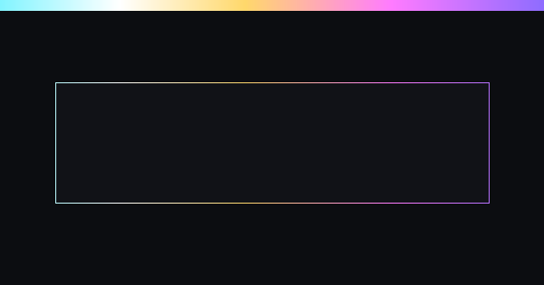

# Example frame widget

A minimal ClarkCant widget that renders a titled frame in its own isolated surface. It mirrors the layout
`clark widget init` produces and exists so the marketplace can verify its indexer against a real package tarball.

## What it asks for

- No capabilities, network origins, filesystem paths, microphone or camera.
- Isolation lane: `isolated-ui` (runs in its own frame, never in the host page).

## Files

| Path | Purpose |
| --- | --- |
| `clarkcant.json` | Package manifest ClarkCant reads before install |
| `widgets/main/index.html` | Widget entry |
| `widgets/main/widget.json` | Widget definition (props, sizing, fallback text) |
| `previews/cover.png` | Listing preview |

See the [widget definition](widgets/main/widget.json) and the
[ClarkCant Marketplace](https://github.com/digitopvn/clarkcant-marketplace) for how packages are listed.
